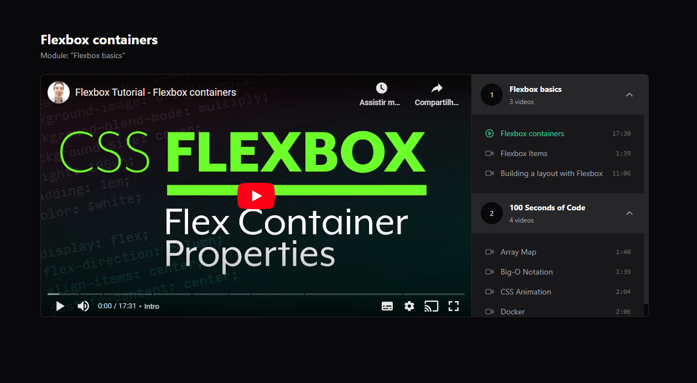

<h1 align="center">Re-Redux</h1>

<p align="center">Video player organized by modules. Made to enhance Redux's abilities.</p>



### Prerequisites

Before starting, you will need to have the following tools installed on your machine:
[Git](https://git-scm.com), [Node.js](https://nodejs.org/en/).
Also it's nice to have an editor to work with the code like [VSCode](https://code.visualstudio.com/)

### 🎲 Running the Front End

```bash
# Clone this repository
$ git clone https://github.com/mestreshake/re-redux.git

# Access the project folder in the terminal/cmd
$cd re-redux

# Install dependencies
$yarn

# Run the application in development mode
$yarn dev

# Run the JSON-SERVER
$yarn server

# The frontend port:5173 - go to <http://localhost:5173>
# The JSON-SERVER port:3000 - go to <http://localhost:3000>
```

### 🛠 Technologies

The following tools were used in the construction of the project:

- ReactJS
- Redux
- Tailwind CSS
- JSON server
- Axios
- Vite
